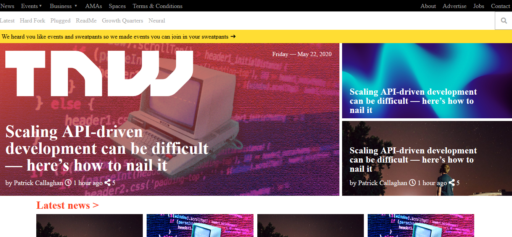

# Responsive_Design

This is the clone version of the TNW (the next web) website. In this me and my partner uses float,grid, flexbox, fluid property and media queries for making the website responsive for all the three version(the mobile phone, iPad and the PC).

## Project Design

Project Design Screenshot : 

## Built With

- HTML5
- CSS3
- Font Awesome icon
- Media Queries

## Original Website

[Original website link](https://thenextweb.com/)

## Live Demo

[Live Demo Link](https://raw.githack.com/Dipeshtwis/Responsive_Design/feature-responsive-design/index.html)


# Github link:

For the: [Github-link](https://github.com/Dipeshtwis/Responsive_Design/tree/feature-responsive-design)

# Getting Started 🚀

These instructions will get you a copy of the project up and running on your local machine.

## How To Use 🔧

From your command line, first clone the project:

```bash
# Clone this repository
$ git clone https://github.com/Dipeshtwis/Responsive_Design.git

# Go into the repository
$ cd Responsive_Design

```

## CONTRIBUTOR

👤 **Dipesh Kumar**

- [Github](@Dipeshtwis)
- [Twitter](@97deepeshkumar)
- [Linkedin](https://www.linkedin.com/in/dipesh-kumar-b6ab88134/)

👤 **Rida Elbahtouri**

- [Github](https://github.com/rida-elbahtouri)
- [Twitter](https://twitter.com/RElbahtouri)
- [Linkedin](https://www.linkedin.com/in/rida-elbahtouri-36a8a7185/)

## Show your support

Give a ⭐️ if you like this project!

## Acknowledgments

- Thanks to Microverse and The Odin Project.
